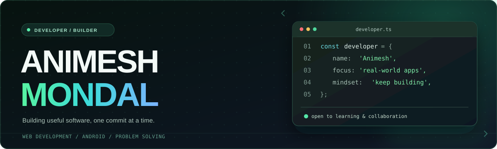

  

   

  

  

    
    
    
  

 

## 👨‍💻 About me

> **Engineering ideas into practical applications.** I enjoy building products that combine thoughtful interfaces, dependable backend systems, and problem-solving.

- 🎓 **B.Tech Computer Science & Engineering** student.
- 🚀 Building web applications, exploring Android development, and improving backend skills.
- 🧠 Interested in **data structures, algorithms, databases, and system design**.
- 🤝 Enjoy collaborating on useful projects — especially **[ReFeed](https://github.com/subhadipmondal99/ReFeed)**, a team effort to reduce food waste.
- 🌱 Currently learning more about **software architecture, Flutter, and deployment**.

 

## ✦ Featured projects

<table>
  <tr>
    <td width="50%" valign="top">
      <h3>🍱 <a href="https://github.com/subhadipmondal99/ReFeed">ReFeed</a></h3>
      
<b>Team collaboration · Food waste reduction</b>

      
A campus food-management platform for demand forecasting, meal planning, surplus identification, and NGO donation coordination.

      

        
        
        
      

      <a href="https://github.com/subhadipmondal99/ReFeed">Explore the team repository ↗</a>
    </td>
    <td width="50%" valign="top">
      <h3>🗺️ <a href="https://github.com/Animesh-666/FOODROUTE">FOODROUTE</a></h3>
      
<b>Full-stack · Route optimization</b>

      
Food-delivery platform with customer/admin/delivery workflows, interactive maps, and route optimization algorithms.

      

        
        
        
      

      <a href="https://github.com/Animesh-666/FOODROUTE">Explore the project ↗</a>
    </td>
  </tr>
  <tr>
    <td width="50%" valign="top">
      <h3>🎓 <a href="https://github.com/Animesh-666/College-Course-Scheduling-System">Course Scheduling</a></h3>
      
<b>Algorithms · Academic project</b>

      
College timetable generation using graph coloring, backtracking, and branch-and-bound techniques to reduce scheduling conflicts.

      

        
        
        
      

      <a href="https://github.com/Animesh-666/College-Course-Scheduling-System">Explore the project ↗</a>
    </td>
    <td width="50%" valign="top">
      <h3>📊 <a href="https://github.com/Animesh-666/teamtrack">TeamTrack</a></h3>
      
<b>MERN · Real-time collaboration</b>

      
A team productivity application built with a React client, Express API, MongoDB, and real-time Socket.IO integration.

      

        
        
        
      

      <a href="https://github.com/Animesh-666/teamtrack">Explore the project ↗</a>
    </td>
  </tr>
</table>

 

## ⚡ Technology & tools

  
<b>Languages &amp; frontend</b>

  

  
<b>Backend &amp; databases</b>

  

  
<b>Developer workflow</b>

  

  Tools I've used across projects and tools I continue learning — not a claim of expertise in every one.

 

## 📈 Development in motion

  
  

  

  
<b>🎮 Bonus: Pac-Man contribution animation</b>

   
  

    
  

 

## 🤝 Let's connect

  
  
    
  <b>Make it useful. Make it better. Keep building.</b>

